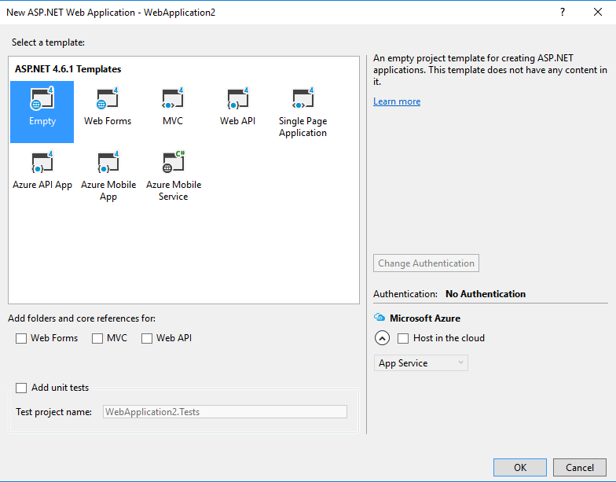
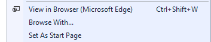
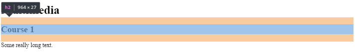

What HTML is
============

-   **HTML** is a language to describe the contents of web documents. It uses a
    special syntax containing markers (called “elements”) which are wrapped
    around the text within the document to indicate how user agents (eg. web
    browsers) should interpret that portion of the document [1].

What HTML looks like
====================

| \<!DOCTYPE html\> \<html\> \<head\> \<title\>**Example page**\</title\> \</head\> \<body\> \<h1\>**Hello world**\</h1\> \</body\> \</html\> |
|---------------------------------------------------------------------------------------------------------------------------------------------|

-   **doctype** - the document first starts with a document type element, or
    doctype. This mainly serves to get the browser to render the HTML in what is
    called "standards mode", so it will work correctly. It also lets validation
    software know what version of HTML to validate your code against. Don't
    worry too much about what this all means for now. We will come back to this
    later. What you can see here is the HTML5 doctype.

-   **\<html\>** - After this, you can see the opening tag of the html element.
    This is a wrapper around the entire document. The closing html tag is the
    last thing in any HTML document.

-   **\<head\>** - Inside the html element, there is the head element. This is a
    wrapper to contain information about the document (the metadata). This is
    described in more detail in The HTML head element. Inside the head is the
    title element, which defines the “Example page” heading in the menu bar.

-   **\<body\>** - After the head element there is a body element, which is the
    wrapper to contain the actual content of the page—in this case, only a
    level-one header (h1) element, which contains the text “Hello world.”

Elements
========

-   An element within another element is referred to as being a **“child”** of
    that element. So in the above example, “h1” is a child of “body”.
    Conversely, the “body” element would be referred to as a **“parent”** of the
    “h1” element. This parent/child concept is important, as it forms the basis
    of **CSS** and is heavily used in **JavaScript**.

| [./media/image1.png](./media/image1.png) | Further reading (mandatory): [W3Schools](http://www.w3schools.com/html/html_elements.asp) |
|------------------------------------------|-------------------------------------------------------------------------------------------|

Attributes
==========

-   Elements can also have attributes, which can modify the behavior of the
    element and introduce extra meaning.

| \<a href=**"http://www.google.com"** target=**"\_blank"**\> **Link** \</a\> |
|-----------------------------------------------------------------------------|

-   Many attributes in HTML are common to all elements, though some are specific
    to a given element or elements.

-   They are always of the form **keyword="value"**.

Block level and inline elements
===============================

-   **Block level** - means a higher level element, normally informing the
    structure of the document. It may help to think of block level elements
    being those that **start on a new line**, breaking away from what went
    before. Some common block level elements include **paragraphs**, **list
    items**, **headings** and **tables**.

-   **Inline elements** - are those that are **contained within block level**
    structural elements and surround only small parts of the document’s content,
    not entire paragrahs and groupings of content. An inline element will not
    cause a new line to appear in the document: they are the kind of elements
    that would appear in a paragraph of text. Some common inline elements
    include hypertext links, highlighted words or phrases and short quotations.

| [./media/image1.png](./media/image1.png) | Further reading: [W3](https://www.w3.org/community/webed/wiki/Main_Page#HTML_beginnings) |
|------------------------------------------|------------------------------------------------------------------------------------------|

1.  The HTML body

    1.  Textual content

-   Page section headings:

| \<h1\>**Multimedia**\</h1\> \<h2\>**Course 1**\</h2\> **Some really long text.** \<h2\>**Course 2**\</h2\> **Another really long text.** |
|------------------------------------------------------------------------------------------------------------------------------------------|

-   Generic paragraphs

| \<p\>**This is a very short paragraph. It only has two sentences.**\</p\> \<p\>**And another one.**\</p\> |
|-----------------------------------------------------------------------------------------------------------|

Assignment

Choice 1: Microsoft Visual Studio Code

1.  Download from <https://code.visualstudio.com/docs/languages/html>

Choice 2: Microsoft Visual Studio 2015

1.  Open Microsoft Visual Studio

2.  Create a new “ASP.NET Web Application” Project as shown bellow

>   [./media/image2.png](./media/image2.png)

1.  Choose the “Empty” Template as shown in the figure bellow.

1.  Add a new html file to the project and name it “index.html”.

2.  In the “index.html” file add the html code included above for section
    headings and generic paragraphs. The result should be similar to the html
    code bellow.

| \<!DOCTYPE html\> \<html\> \<head\> \<title\>**Example page**\</title\> \</head\> \<body\> \<h1\>**Multimedia**\</h1\> \<h2\>**Course 1**\</h2\> **Some really long text.** \<h2\>**Course 2**\</h2\> **Another really long text.** \<p\>**This is a very short paragraph. It only has two sentences.**\</p\> \<p\>**And another one.**\</p\> \</body\> \</html\> |
|-------------------------------------------------------------------------------------------------------------------------------------------------------------------------------------------------------------------------------------------------------------------------------------------------------------------------------------------------------------------|

3.  Open the page in Google Chrome by right clicking on it and choosing the
    “Browse With” option from the contextual menu, as shown in the figure
    bellow.

    

4.  Are the headings inline or block elements?

5.  Are the paragraphs inline or block elements?

6.  Use the Developer Tools in Google Chrome to select the elements in your
    page. Notice that for headings and paragraphs the whole line is selected, as
    shown below.

| [./media/image1.png](./media/image1.png) | Further reading: [W3](https://www.w3.org/community/webed/wiki/Marking_up_textual_content_in_HTML) |
|------------------------------------------|---------------------------------------------------------------------------------------------------|

Lists
-----

-   There are three list types in HTML:

    -   unordered list — used to group a set of related items, in no particular
        order.

| \<ul\> \<li\>**bread**\</li\> \<li\>**coffee beans**\</li\> \<li\>**milk**\</li\> \<li\>**butter**\</li\> \</ul\> |
|-------------------------------------------------------------------------------------------------------------------|

-   ordered list — used to group a set of related items, in a specific order.

| \<ol\> \<li\>**Gather ingredients**\</li\> \<li\>**Mix ingredients together**\</li\> \<li\>**Place ingredients in a baking dish**\</li\> \<li\>**Bake in oven for an hour**\</li\> \<li\>**Remove from oven**\</li\> \<li\>**Allow to stand for ten minutes**\</li\> \<li\>**Serve**\</li\> \</ol\> |
|-----------------------------------------------------------------------------------------------------------------------------------------------------------------------------------------------------------------------------------------------------------------------------------------------------|

-   description list — used to display name/value pairs such as terms and their
    definitions, or times and events.

| \<dl\> \<dt\>**Name**\</dt\> \<dd\>**Value**\</dd\> \<dt\>**Name**\</dt\> \<dd\>**Value**\</dd\> \<dt\>**Name**\</dt\> \<dd\>**Value**\</dd\> \</dl\> |
|-------------------------------------------------------------------------------------------------------------------------------------------------------|

Assignment

1.  Test the examples above in the “index.html” file created earlier.

| [./media/image1.png](./media/image1.png) | Further reading: [W3](https://www.w3.org/community/webed/wiki/HTML_lists) |
|------------------------------------------|---------------------------------------------------------------------------|

Images
------

-   Displaying an image

| \ |
|----------------------------------------------------------------------------------------------------------------------------------|

-   Displaying an image together with a caption

| \<figure\> \ \<figcaption\>**Wikipedia Logo**\</figcaption\> \</figure\> |
|---------------------------------------------------------------------------------------------------------------------------------------------------------------------------------------------------------|

Assignment

1.  Test the examples above in the “index.html” file created earlier.

| [./media/image1.png](./media/image1.png) | Further reading: [W3](https://www.w3.org/community/webed/wiki/Images_in_HTML) |
|------------------------------------------|-------------------------------------------------------------------------------|

Links
-----

-   **a** element

| \<a href=**"http://www.opera.com"**\>**Opera Software**\</a\> |
|---------------------------------------------------------------|

-   **href** attribute - can contain different values:

    -   A URL in the same folder (help.html), relative to the current folder
        (for example “../../help/help.html” — 2 dots means “go up one level in
        the site folder hierarchy”) or absolute to the server root (for example
        “/help/help.html” — having a forward slash at the front of the address
        means the address starts at the root of the computer the page is on.)

    -   A URL on a different server altogether (for example
        http://wait-till-i.com or ftp://ftp.opera.com/ or
        <http://developer.yahoo.com/yui>).

    -   A fragment identifier or id name preceded by a hash (for example
        “\#menu”). This points to a target inside the same document.

    -   A mixture of URLs and fragment identifiers — you can link directly to a
        section of a different document by pointing the href attribute to a URL
        followed by a fragment identifier (for example
        http://dev.opera.com/articles/view/new-structural-elements-in-html5/\#aside).

Assignment

1.  Test the following html code in the “index.html” file created earlier.

| \<a href=**"http://www.wikipedia.org"** target=**"\_blank"**\> \ \</a\> |                                                                                              |
|--------------------------------------------------------------------------------------------------------------------------------------------------------------------------------------------------------|----------------------------------------------------------------------------------------------|
| [./media/image1.png](./media/image1.png)                                                                                                                                                               | Further reading: [W3](https://www.w3.org/community/webed/wiki/HTML_links_-_lets_build_a_web) |

Tables
------

Assignment

1.  Add a new html file to the project created earlier and name it
    “agenda.html”.

2.  Test the following HTML code in the “agenda.html” file created earlier.

| \<!DOCTYPE html\> \<html\> \<head\> \<title\>**Agenda telefonică**\</title\> \</head\> \<body\> \<h1\>**Agenda telefonică**\</h1\> \<table\> \<caption\> **Lista persoane** \</caption\> \<thead\> \<tr\> \<th\>**Nume**\</th\> \<th\>**Prenume**\</th\> \<th\>**Telefon**\</th\> \</tr\> \</thead\> \<tbody\> \<tr\> \<td\>**Popescu**\</td\> \<td\>**Ion**\</td\> \<td\>**023423222**\</td\> \</tr\> \<tr\> \<td\>**Vasilescu**\</td\> \<td\>**Maria**\</td\> \<td\>**073423222**\</td\> \</tr\> \</tbody\> \<tfoot\> \<tr\> \<td colspan=**"3"**\>**Număr persoane: 2**\</td\> \</tr\> \</tfoot\> \</table\> \</body\> \</html\> |
|-------------------------------------------------------------------------------------------------------------------------------------------------------------------------------------------------------------------------------------------------------------------------------------------------------------------------------------------------------------------------------------------------------------------------------------------------------------------------------------------------------------------------------------------------------------------------------------------------------------------------------------|

3.  Notice the colspan=”3” attribute. What effect does it have?

| [./media/image1.png](./media/image1.png) | Further reading: [W3](https://www.w3.org/community/webed/wiki/HTML_tables) |
|------------------------------------------|----------------------------------------------------------------------------|

Forms
-----

-   An HTML form contains form elements.

-   Form elements are different types of input elements, like text fields,
    checkboxes, radio buttons, submit buttons, and more.

| [./media/image1.png](./media/image1.png) | Further reading: [W3](https://www.w3.org/community/webed/wiki/HTML_forms_-_the_basics), [W3Schools](http://www.w3schools.com/html/html_forms.asp) |
|------------------------------------------|---------------------------------------------------------------------------------------------------------------------------------------------------|

Assignment

1.  Add the \<form\> HTML code in the “agenda.html” file created earlier.

| …… \</tfoot\> \</table\> \<form action=**"\#"**\> \<label for=**"nume"**\>**Nume:**\</label\> \<input name=**"nume"** id=**"nume"**\> \<label for=**"prenume"**\>**Prenume:**\</label\> \<input name=**"prenume"** id=**"prenume"**\> \<label for=**"Telefon"**\>**Telefon:**\</label\> \<input name=**"telefon"** id=**"telefon"**\> \<input type=**"button"** id=**"btnAdauga"** name=**"btnAdauga"** value=**"Adaugă"**\> \</form\> \</body\> \</html\> |
|------------------------------------------------------------------------------------------------------------------------------------------------------------------------------------------------------------------------------------------------------------------------------------------------------------------------------------------------------------------------------------------------------------------------------------------------------------|

2.  Open the page in a browser at your choice.

3.  Check whether the displayed page is similar to the one shown below.

>   [./media/image6.png](./media/image6.png)

DOM
===

-   when a web page is loaded, the browser creates a **D**ocument **O**bject
    **M**odel of the page.

-   The **HTML DOM** model is constructed as a tree of **Objects** as shown
    below.

    

| [./media/image1.png](./media/image1.png) | Further reading: [W3Schools](http://www.w3schools.com/js/js_htmldom.asp)s |
|------------------------------------------|---------------------------------------------------------------------------|

Assignment

1.  Check the HTML DOM for the previous assignment.

2.  Further Reading

    1.  Mandatory

-   [W3C WebEd - HTML
    Beginings](http://www.w3.org/community/webed/wiki/Main_Page#HTML_beginnings)
    (especially the section 1. The basics of HTML)

-   [W3C WebEd - The HTML
    body](http://www.w3.org/community/webed/wiki/Main_Page#The_HTML_body)
    (especially sections 1 - 6)

    1.  Optional

-   http://slides.html5rocks.com

Bibliography
============

[1] “The basics of HTML - Web Education Community Group.” [Online]. Available:
https://www.w3.org/community/webed/wiki/The\_basics\_of\_HTML. [Accessed:
09-Oct-2016].
