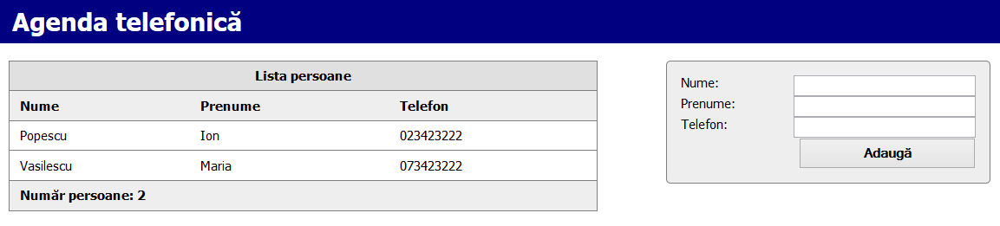

# Cascading Style Sheets - CSS

## 1. Documentation
- https://cssreference.io/

## What **CSS** is

-   **Cascading Style Sheets** (**CSS**) are a
    [stylesheet](https://developer.mozilla.org/en-US/docs/DOM/stylesheet)
    language used to describe the presentation of a document written in
    [HTML](https://developer.mozilla.org/en-US/docs/HTML) or
    [XML](https://developer.mozilla.org/en-US/docs/XML) (including XML dialects
    like [SVG](https://developer.mozilla.org/en-US/docs/SVG) or
    [XHTML](https://developer.mozilla.org/en-US/docs/XHTML)). CSS describes how
    elements should be rendered on screen, on paper, in speech, or on other
    media [1].

-   While HTML structures the document and tells browsers what a certain
    element’s function is (it is a link to another page? Is it a heading?), CSS
    gives the browser instructions on how to display a certain element —
    styling, spacing, colouring, etc.

Assignment

-   Try the CSS Demo available at <http://www.w3schools.com/css/css_intro.asp>
    in your favorite browser.

-   Check the Visual Reference: <http://cssreference.io/>

Structure of a CSS Rule
=======================

-   Defining CSS styles is accomplished using sets of rules like the one bellow.

| selector { property1:value; property2:value; property3:value; } |
|-----------------------------------------------------------------|

-   **selector** - identifies the HTML elements that the rule will be applied
    to, using actual element names, eg. \<body\>, or another identifier such as
    class attribute values.

-   **curly braces** - contain the property/value pairs, which are separated
    from each other by semi-colons; the properties are separated from their
    respective values by colons.

    -   **properties** - define what you want to do to the element(s) you have
        selected. These come in wide varieties, which can affect text colour,
        background colour, position on the page, font type, border colour and
        thickness and many other things.

    -   **values** - are the values that you want to set for each property of
        the selected elements. The values are dependent on the property, for
        example properties that affect colour can take hexadecimal colours like
        \#336699, RGB values like rgb(12,134,22) or colour names like red, green
        or blue. Properties that affect position, margins, width, height etc.
        can be measured in pixels, ems, percentages, centimeters or other such
        units [2].

1.  Basic types of selectors

    1.  Element Selector

| p {} |
|------|

-   **element selector** - matches all the elements of that name on the page
    (\<p\> elements, in the case above).

    1.  Class Selector

| .example {} |
|-------------|

-   **class selector** - matches all elements that have a class attribute with
    the value specified, so the above would match \
, \<li
    class="example"\> or \
, or any other element with a
    class of example. Note that class selectors don't test for any specific
    element name.

    1.  ID Selector

| \#example {} |
|--------------|

-   **id selector** - matches all elements that have an id attribute with the
    value specified, so the above would match \
, \<li
    id="example"\> or \
, or any other element with an id of
    example. Note that ID selectors don’t test for any element name, and you can
    only have one of each ID per HTML document — they are unique to each page.

| [./media/image1.png](./media/image1.png) | Further reading: [CSS3 Basics](https://www.w3.org/wiki/CSS_basics) |
|------------------------------------------|--------------------------------------------------------------------|

Assignment

1.  Open the following JSFiddle: <https://jsfiddle.net/liviucotfas/uyh7n7ds/>

2.  Write a selector that changes the color of the paragraphs to grey (element
    selector)

3.  Write a selector that changes the color of the elements that have the
    “assignment” class (class sector)

4.  Write a selector that changes the color of the element with the Id
    “firstAssignment” (id selector)

Combining CSS Selectors
=======================

You can join some selectors to define even more specific rules:

-   p.warning{} matches all paragraphs with the class of warning

-   div\#example{} matches the element with the id attribute \#example, but only
    when it is a div

-   p.info, li.highlight{} matches paragraphs with a class of info and list
    items with a class of highlight

Advanced CSS selectors
======================

-   **Universal selectors:** universal selectors can be used to select every
    element on the page.

| \* { border: 1px solid \#000000; } |
|------------------------------------|

-   **Attribute selectors:** as their name suggests, attribute selectors allow
    you to select elements based on their attributes.

| img[alt] { border: 1px solid \#000000; } |
|------------------------------------------|

-   **Child selectors:** if you want to select specific elements that are
    children of other specific elements, use this selector.

| h3 \> strong { color: blue; } |
|-------------------------------|

-   **Descendent selectors:** if you want to select specific elements that are
    descendents of other specific elements (not just direct children, but
    further down in the tree as well), you can use this selector type.

| div em { ... } |
|----------------|

-   **Adjacent sibling selectors:** if you want to select just specific elements
    that follow other specific elements, use these selectors.

| h2 + p { ... } |
|----------------|

-   **Pseudo-classes:** these allow you to style elements based not on what the
    elements are, but on more esoteric factors such as the states of links (eg
    if they are being hovered over, or have been visited already).

| a:link { color: blue;} a:visited { color: gray;} a:hover, a:focus {text-decoration: none;} a:active { font-weight: bold;} |
|---------------------------------------------------------------------------------------------------------------------------|

-   **Pseudo-elements:** these allow you to style specific parts of elements,
    rather than the whole element (eg the first letter within that element);
    they also allow you to insert content before or after specific elements.

| p:first-letter { font-weight: bold; font-size: 300% background-color: red; } |                                                                                                           |
|------------------------------------------------------------------------------|-----------------------------------------------------------------------------------------------------------|
| [./media/image1.png](./media/image1.png)                                     | Further reading: [Advanced CSS selectors](https://www.w3.org/community/webed/wiki/Advanced_CSS_selectors) |

Assignment

-   Try the universal selector in JSFiddle

-   Try the adjacent sibling selectors in JSFiddle

-   Try the pseudo-classes selectors in JSFiddle

-   Try the pseudo-elements selectors in JSFiddle

Applying CSS to HTML
====================

Includere unui stil / a unui set de stiluri într-o pagina HTML se poate realiza:

-   inline: atribut style

| \
Paragraph\</p\> |
|-------------------------------------------------------------------------|

-   embedded: tag \<style\>

| \<style type="text/css" media="screen"\> p { color:white; background:blue; padding:5px; } \</style\> |
|------------------------------------------------------------------------------------------------------|

-   external files: tag link

| \<link rel="stylesheet" href="styles.css" type="text/css" media="screen"\> |                                                                    |
|----------------------------------------------------------------------------|--------------------------------------------------------------------|
| [./media/image1.png](./media/image1.png)                                   | Further reading: [CSS3 Basics](https://www.w3.org/wiki/CSS_basics) |

Assignment

-   When do you think that it is useful to use inline styles?

-   When it would be better to use embedded styles?

-   What about using an external CSS file?

1.  Inheritance and cascade

    1.  Inheritance

-   Inheritance is associated with how the elements in the HTML markup inherit
    properties from their parent (containing) elements and pass them on to their
    children

-   Not all CSS properties are inherited, because it doesn’t make sense for some
    of them to be. For instance, margins and width are not inherited, since it’s
    unlikely that a child element should need the same margins as its parent.
    Imagine if you set the content block of a site to be 70% of the browser
    window width, and then had all of its children adopting a width of 70% of
    their parents? Doing page layouts with CSS would be a nightmare.

-   In most cases common sense will tell you which properties are inherited and
    which aren’t. For CSS3 properties, you'll have to consult the individual
    CSS3 module specifications, available in the [CSS current work
    page](http://www.w3.org/Style/CSS/current-work)

    1.  Cascade

-   The cascade has to do with the CSS declarations being applied to a document,
    and how conflicting rules do or don’t override each other.

-   There are three main concepts that control the order in which CSS
    declarations are applied:

    -   Importance

    -   Specificity

    -   Source order

-   If two declarations have the same importance, the specificity of the rules
    decide which one will apply. If the rules have the same specificity, then
    source order controls the outcome.

    1.  Importance

-   The importance of a CSS declaration depends on *where* it is specified. The
    conflicting declarations will be applied in the following order, with later
    ones overriding earlier ones:

1.  User agent style sheets

2.  Normal declarations in author style sheets

3.  Important declarations in author style sheets

    1.  Specificity

-   A selector with low specificity may match many elements (like \*, which
    matches every element in the document), while a selector with high
    specificity might only match a single element on a page (like \#nav, which
    only matches the element with an id of nav).

    1.  Source Order

-   If two declarations affect the same element, have the same importance and
    the same specificity, the final distinguishing mark is the source order. The
    declaration that appears later in the style sheets will “win” over those
    that come before it.

| [./media/image1.png](./media/image1.png) | Further reading: [Inheritance and Cascade](https://www.w3.org/community/webed/wiki/Inheritance_and_cascade)s |
|------------------------------------------|--------------------------------------------------------------------------------------------------------------|

Assignment

-   Open the following JSFiddle:
    <http://fiddle.jshell.net/liviucotfas/ksy8f2ep/>

-   Why is the text displayed in violet and not in green?

-   Is the border property inherited? Think about it first—would it make
    sense?—then look up the correct answer in the [CSS
    specification](http://www.w3.org/TR/CSS21/).

CSS text styling
================

-   font-family

| font-family: Arial; |
|---------------------|

-   font-weight allows you to set the boldness of text in selected elements.

| p { font-weight: bold; } |
|--------------------------|

-   font-style allows you to set a element's text to be oblique or italic.

| font-style: italic; |
|---------------------|

1.  CSS layout model - boxes borders margins padding

    1.  CSS Margin

-   The CSS margin properties are used to generate space around elements.

-   The margin properties set the size of the white space outside the border.

| p **{ margin-top: 100px; margin-right: 150px; margin-bottom: 100px; margin-left: 80px; }** /\*equivalent to\*/ p **{ margin: 100px 150px 100px 80px; }** |                                                                             |
|----------------------------------------------------------------------------------------------------------------------------------------------------------|-----------------------------------------------------------------------------|
| [./media/image1.png](./media/image1.png)                                                                                                                 | Further reading: [CSS Margin](http://www.w3schools.com/css/css_margin.asp)s |

CSS Padding
-----------

-   The CSS padding properties are used to generate space around content.

| [./media/image1.png](./media/image1.png) | Further reading: [CSS Padding](http://www.w3schools.com/css/css_padding.asp)s |
|------------------------------------------|-------------------------------------------------------------------------------|

CSS Box Model
-------------

-   All HTML elements can be considered as boxes. In CSS, the term "box model"
    is used when talking about design and layout.

-   The CSS box model is essentially a box that wraps around every HTML element.
    It consists of: margins, borders, padding, and the actual content.

| [./media/image1.png](./media/image1.png) | Further reading: [CSS layout model](https://www.w3.org/community/webed/wiki/The_CSS_layout_model_-_boxes_borders_margins_padding) and [CSS Box Model](http://www.w3schools.com/css/css_boxmodel.asp) |
|------------------------------------------|------------------------------------------------------------------------------------------------------------------------------------------------------------------------------------------------------|

Assignment

-   Open the JSFiddle <http://jsfiddle.net/liviucotfas/4scp322v/>

-   Check de CSS Box Model for an element in the Chrome Developer Tools.

-   Modify the margin, padding properties.

Styling tables and forms
========================

| [./media/image1.png](./media/image1.png) | Further reading: [W3C WebEd - CSS](http://www.w3.org/community/webed/wiki/Main_Page#CSS) : *9. Styling forms*, *10. Floats and clearing* |
|------------------------------------------|------------------------------------------------------------------------------------------------------------------------------------------|

1.  Floats and clearing

    1.  Float

-   The **float** CSS property specifies that an element should be taken from
    the normal flow and placed along the left or right side of its container,
    where text and inline elements will wrap around it [3].

| [./media/image1.png](./media/image1.png) | Further reading: [W3C WebEd - Floats and clearing](https://www.w3.org/community/webed/wiki/Floats_and_clearing) |
|------------------------------------------|-----------------------------------------------------------------------------------------------------------------|

Clear
-----

-   The **clear** CSS property specifies whether an element can be next to
    floating elements that precede it or must be moved down (cleared) below
    them. The clear property applies to both floating and non-floating elements
    [4].

CSS static, relative positioning, absolute and fixed positioning
================================================================

| [./media/image1.png](./media/image1.png) | Further reading: [W3C WebEd - CSS](http://www.w3.org/community/webed/wiki/Main_Page#CSS) : *11. CSS static and relative positioning și 12. CSS absolute and fixed positioning* |
|------------------------------------------|--------------------------------------------------------------------------------------------------------------------------------------------------------------------------------|

Twitter Bootstrap
=================

| [./media/image3.png](./media/image3.png) | Bootstrap is the second most-starred project on GitHub. |
|------------------------------------------|---------------------------------------------------------|

-   Bootstrap is a free and open-source front-end web framework for designing
    websites and web applications. It contains HTML- and CSS-based design
    templates for typography, forms, buttons, navigation and other interface
    components, as well as optional JavaScript extensions. Unlike many web
    frameworks, it concerns itself with front-end development only.

-   Available at: <http://getbootstrap.com>

Assignment

1.  Create a new project in Microsoft Visual Studio

2.  Add a new html file to the project created earlier and name it
    “Agenda\_HTML\_CSS.html”.

| \<!DOCTYPE html\> \<html\> \<head\> \<title\>**Agenda telefonică**\</title\> \</head\> \<body\> \<h1\>**Agenda telefonică**\</h1\> \<table\> \<caption\> **Lista persoane** \</caption\> \<thead\> \<tr\> \<th\>**Nume**\</th\> \<th\>**Prenume**\</th\> \<th\>**Telefon**\</th\> \</tr\> \</thead\> \<tbody\> \<tr\> \<td\>**Popescu**\</td\> \<td\>**Ion**\</td\> \<td\>**023423222**\</td\> \</tr\> \<tr\> \<td\>**Vasilescu**\</td\> \<td\>**Maria**\</td\> \<td\>**073423222**\</td\> \</tr\> \</tbody\> \<tfoot\> \<tr\> \<td colspan=**"3"**\>**Număr persoane: 2**\</td\> \</tr\> \</tfoot\> \</table\> \<form action=**"\#"**\> \<label for=**"nume"**\>**Nume:**\</label\> \<input name=**"nume"** id=**"nume"**\> \<label for=**"prenume"**\>**Prenume:**\</label\> \<input name=**"prenume"** id=**"prenume"**\> \<label for=**"Telefon"**\>**Telefon:**\</label\> \<input name=**"telefon"** id=**"telefon"**\> \<input type=**"button"** id=**"btnAdauga"** name=**"btnAdauga"** value=**"Adaugă"**\> \</form\> \</body\> \</html\> |
|---------------------------------------------------------------------------------------------------------------------------------------------------------------------------------------------------------------------------------------------------------------------------------------------------------------------------------------------------------------------------------------------------------------------------------------------------------------------------------------------------------------------------------------------------------------------------------------------------------------------------------------------------------------------------------------------------------------------------------------------------------------------------------------------------------------------------------------------------------------------------------------------------------------------------------------------------------------------------------------------------------------------------------------------------|

3.  Add the CSS file “Agenda\_HTML\_CSS.css” with the following content.

| [./media/image4.png](./media/image4.png)                                                                                                                                                                                                                                                                                                                                                                                                                                                                                                                                                                                                                                                                                                                                                                                                                                                                                                                                                                   | If you don’t know the meaning of a specific CSS property, you can always search it on [W3Schools](http://www.w3schools.com) |
|------------------------------------------------------------------------------------------------------------------------------------------------------------------------------------------------------------------------------------------------------------------------------------------------------------------------------------------------------------------------------------------------------------------------------------------------------------------------------------------------------------------------------------------------------------------------------------------------------------------------------------------------------------------------------------------------------------------------------------------------------------------------------------------------------------------------------------------------------------------------------------------------------------------------------------------------------------------------------------------------------------|-----------------------------------------------------------------------------------------------------------------------------|
| body **{ font-family: tahoma; font-size: 11pt; line-height: 1.2em; margin: 0; padding: 12px; }** h1 **{ background-color: Navy; color: White; margin: 0; padding: 16px; margin: -12px -12px 20px -12px; }** table **{ border: 1px solid Gray; border-collapse: collapse; text-align: left; width: 60%; float: left; }** td**,** th **{ padding: 8px 12px; border-bottom: 1px solid Gray; }** th **{ background-color: \#EEEEEE; }** caption **{ padding: 8px 12px; border: 1px solid Gray; border-bottom: none; background-color: \#E0E0E0; font-weight: bold; }** tfoot **{ background-color: \#EEEEEE; font-weight: bold;**  **}** form **{ border: 1px solid Gray; border-radius: 5px; background-color: \#EEEEEE; padding: 16px;**  **float: right;**  **width: 30%;**  **}** label **{ display: block; float: left; clear: both; width: 35%; }** input **{ font-size: 11pt; display: block; float: right;**  **width: 60%; }** input**[**type="button"**] { font-weight: bold;**  **padding: 5px; }** |                                                                                                                             |

4.  Reference the CSS file from the heading section of the
    “Agenda\_HTML\_CSS.html” file.

| \<head\> \<title\>Agenda telefonică\</title\> **\<link rel="stylesheet" type="text/css" href="Agenda\_HTML\_CSS.css"\>** \</head\> |
|------------------------------------------------------------------------------------------------------------------------------------|

5.  Open the page in a browser at your choice.

6.  Check whether the displayed page is similar to the one shown below.

Bibliography
============

[1] “CSS,” *Mozilla Developer Network*. [Online]. Available:
https://developer.mozilla.org/en-US/docs/Web/CSS. [Accessed: 09-Oct-2016].

[2] “CSS basics - W3C Wiki.” [Online]. Available:
https://www.w3.org/wiki/CSS\_basics. [Accessed: 09-Oct-2016].

[3] “float,” *Mozilla Developer Network*. [Online]. Available:
https://developer.mozilla.org/en-US/docs/Web/CSS/float. [Accessed: 10-Oct-2016].

[4] “clear,” *Mozilla Developer Network*. [Online]. Available:
https://developer.mozilla.org/en-US/docs/Web/CSS/clear. [Accessed: 10-Oct-2016].
