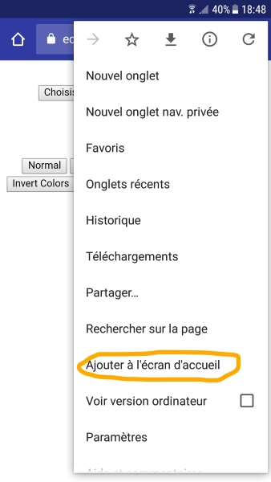

# 2D Raster Graphics

<!-- vscode-markdown-toc -->
* 1. [Objectives](#Objectives)
* 2. [Documentation](#Documentation)
* 3. [Demos](#Demos)
* 4. [Assignments](#Assignments)
	* 4.1. [Assignment 1](#Assignment1)
	* 4.2. [Assignment 2](#Assignment2)
	* 4.3. [Assignment 3](#Assignment3)
	* 4.4. [Assignment 4](#Assignment4)

<!-- vscode-markdown-toc-config
	numbering=true
	autoSave=true
	/vscode-markdown-toc-config -->
<!-- /vscode-markdown-toc -->

##  1. <a name='Objectives'></a>Objectives
- drawing various shapes on the `canvas` (rectangles, lines, etc.);
- loading an image using drag and drop;
- loading an image using the file picker;
- loading an image using the clipboard;
- drawing the histogram for an image;
- applying various effects on an image;
- saving the content of the canvas as a `*.png` or `.jpeg` file.
##  2. <a name='Documentation'></a>Documentation
- HTML5 Canvas: <https://developer.mozilla.org/en-US/docs/Web/API/Canvas_API/Tutorial/Using_images>
- (optional) HTML Living Standard: <https://html.spec.whatwg.org/#the-canvas-element>

##  3. <a name='Demos'></a>Demos
-   Capture image from the web cam:
    <https://developer.mozilla.org/en-US/docs/Web/API/WebRTC_API/Taking_still_photos>
-   Image zoom: <http://phrogz.net/tmp/canvas_image_zoom.html>
-   Image effects: <http://www.html5rocks.com/en/tutorials/canvas/imagefilters/>
- Slideshow: <https://www.google.com/logos/2016/slideshow/slideshow.html?doodle=holidays-2017-day-2&hl=fr>

##  4. <a name='Assignments'></a>Assignments
###  4.1. <a name='Assignment1'></a>Assignment 1
1. Try the "canvas-bar-chart" sample by clicking [here](https://ase-multimedia.azurewebsites.net/canvas-bar-chart). 
2. Check the source code in the `code-examples.zip` archive or in the `code-examples` folder. 
3. Complete the assignments included in the ```html``` file. 

###  4.2. <a name='Assignment2'></a>Assignment 2
1. Try the "canvas-drag-drop" sample by clicking [here](https://ase-multimedia.azurewebsites.net/canvas-drag-drop). 

> HTML Drag and Drop API:
https://developer.mozilla.org/en-US/docs/Web/API/HTML_Drag_and_Drop_API

2. Check the source code in the `code-examples.zip` archive or in the `code-examples` folder. 
3. Complete the assignments included in the ```html``` file. 
4. Allow the user to load images using `Ctrl+C` and `Ctrl+V` (hint: use the [Clipboard API](https://developer.mozilla.org/en-US/docs/Web/API/Clipboard_API)).

###  4.3. <a name='Assignment3'></a>Assignment 3
1. Try the "canvas-processing-2.html" sample by clicking [here](https://ase-multimedia.azurewebsites.net/canvas-processing-2). 
2. Check the source code in the `code-examples.zip` archive or in the `code-examples` folder. 
3. Complete the assignments included in the `js` file.

###  4.4. <a name='Assignment4'></a>Assignment 4
1. Try the "canvas-image-editor" sample by clicking [here](https://ase-multimedia.azurewebsites.net/canvas-image-editor). 
    > Note: only the "Normal" and the "Black and White" effects are implemented.
2. Also try the sample on your mobile phone. Add a shortcut to the application on the homescreen of your phone as shown in the following image. Launch the application using the shortcut.

    
2. Download the `code-examples.zip` archive. We'll be doing all our coding work in a directory called `canvas-image-editor-dev`. The directory called `canvas-image-editor-final` contains the final version of the application.
3. Add an `html` file called `index.html` and add the code included below.
    ```html
    <!DOCTYPE html> 
    <html>

    <head>
        <meta charset="utf-8" />
        <title>Image Editor</title>

        <script 
            src="https://code.jquery.com/jquery-latest.js"
            crossorigin="anonymous"></script>
    </head>

    <body style="text-align:center;">
        <div>
            <label for="fileBrowser">Choose file to upload</label>
            <!-- https://developer.mozilla.org/en-US/docs/Web/HTML/Element/input/file -->
            <input type="file" id="fileBrowser" name="fileBrowser" value="Choose image"
                accept="image/*">
        </div>

        <h2>Transformed</h2>
        <div>
            <!-- https://developer.mozilla.org/en/docs/Web/Guide/HTML/Using_data_attributes -->
            <button type="button" class="effectType" data-effect="normal">Normal</button>

            <button type="button" class="effectType" data-effect="blackWhite">Black & White</button>
            <button type="button" class="effectType" data-effect="threshold">Threshold</button>
            <button type="button" class="effectType" data-effect="sephia">Sephia</button>
            <button type="button" class="effectType" data-effect="invert">Invert Colors</button>
            <button type="button" class="effectType" data-effect="pixelate">Pixelate</button>
            <button type="button" class="effectType" data-effect="twoChannels">2 Channels</button>
            <button type="button" class="effectType" data-effect="red">Red</button>
            <button type="button" class="effectType" data-effect="green">Green</button>
            <button type="button" class="effectType" data-effect="blue">Blue</button>
        </div>
        <a id="donwloadLink" href="#" download="processedImage.png">
            <!-- 
                download attribute: download file when clicking on the link (instead of navigating to the file)
                http://www.w3schools.com/tags/att_a_download.asp
            -->
            </canvas>
        </a>
    </body>

    </html>
    ```
4. In the ```<head>``` section of the HTML file add some additional metadata for controlling how the application will be displayed in a mobile browser

    ```HTML
     <meta name="viewport" content="width=device-width, initial-scale=1, maximum-scale=1.0, user-scalable=0">
    ```

5. Add a `JavaScript` file called `canvas-processing-3.js` and reference it from the `html` as shown below.

    ```HTML
     <script src="canvas-processing-3.js"></script>
    ```

6. Update the `JavaScript` file as follows.
   ```JavaScript
    (function () {
        'use strict';

        var app = {
            originialImage: null,
            processedImage: null,
            donwloadLink: null,
            currentEffect: null
        }
    })();
    ```

7. When the `DOM` has finished loading, initialize the properties of the `app` object.

    ```JavaScript
    app.originialImage = document.createElement("img");
    app.donwloadLink = document.getElementById("donwloadLink");
    app.processedImage = document.getElementById("processedImage");
    ```

8. On the `app` object add the following method `drawImage` (used for displaying the image), `normal` (normal effect) and `blackWhite` (black and white effect).

    ```JavaScript
    app.drawImage = function() {
       
        //https://developer.mozilla.org/en-US/docs/Web/API/Performance/now
        let t0 = performance.now();
        console.log("t0: "+t0);

        let processingCanvas = document.createElement('canvas');
        processingCanvas.width = app.originialImage.naturalWidth;
        processingCanvas.height = app.originialImage.naturalHeight;
        let context = processingCanvas.getContext("2d");
        context.drawImage(app.originialImage, 0, 0, processingCanvas.width, processingCanvas.height);

        let t1 = performance.now();
        console.log(t1-t0 + ": drawing the image on the canvas");

        switch (app.currentEffect) {
            case "normal":
                app.normal(context);
                break;
            case "grayscale":
                app.grayscale(context);
                break;
        }

        let t2 = performance.now();
        console.log(t2-t1+": applying the effect on the canvas");
              
        processingCanvas.toBlob(function(blob){
            let blobUrl = URL.createObjectURL(blob);
            app.processedImage.src = blobUrl;
            app.donwloadLink.href = blobUrl;
        },"image/png");

        let t3 = performance.now();
        console.log(t3-t2 + ": generating a blob from the processed canvas");
        
        console.log("finished");
    }

    app.normal = function(context){
        
    }

    app.grayscale = function(context){
        let imageData = context.getImageData(0, 0, context.canvas.width, context.canvas.height);
        let pixels = imageData.data;
        for (let i = 0; i < pixels.length; i += 4)
            pixels[i] = pixels[i + 1] = pixels[i + 2] = Math.round((pixels[i] + pixels[i + 1] + pixels[i + 2]) / 3);
        context.putImageData(imageData, 0, 0); 
    }
    ```

9. Add the `changeEffect` method, that will be used for changing the current effect.

    ```JavaScript
     app.changeEffect = function(effect){
        if(effect !== app.currentEffect)
        {
            app.currentEffect = effect;
            app.drawImage();
        }
    }
    ```

10. Call the `changeEffect` method when a button is pressed in the UI

    ```JavaScript
    $('.effectType').click(function () {
        //more about the data attribute: https://developer.mozilla.org/en/docs/Web/Guide/HTML/Using_data_attributes
        app.changeEffect($(this).data("effect")); //equivalent to $(this)[0].dataset.effect
    });
    ```

11. Handle the `change` event of the file input as follows.

    ```JavaScript
    document.getElementById("fileBrowser").addEventListener("change",function(e){  
        //1. create the reader
        var reader = new FileReader();
        //2. attach events
        reader.onload = function(event){
            app.originialImage.src = event.target.result;
        }
        //3. start loading the file
        reader.readAsDataURL(e.target.files[0]);    
    });
    ```

12. Handle the `load` event of the originialImage element in order to display the image.

    ```JavaScript
    app.originialImage.addEventListener("load",function(){
            app.currentEffect = null;
            app.changeEffect("normal");
    });
    ```

13. Handle the `onerror` event of the originialImage element.

    ```JavaScript
    /*app.originialImage.onerror = function (msg, source, lineNo) {
            alert("Mesaj eroare: {0}".format(msg));
    };*/
    app.originialImage.addEventListener("error", function (msg) {
            alert("Mesaj eroare: {0}".format(msg));
    });
    ```

17. Let's make the application more mobile friendly by defining icons, theme-color, etc.

    ```HTML
    <meta name="theme-color" content="#2F3BA2">
    <link rel="icon" sizes="192x192" href="img/icons/icon-192x192.png">
    <meta name="apple-mobile-web-app-capable" content="yes">
    <meta name="apple-mobile-web-app-status-bar-style" content="black">
    <meta name="apple-mobile-web-app-title" content="Image Editor">
    <link rel="apple-touch-icon" href="img/icons/icon-152x152.png">
    <meta name="msapplication-TileImage" content="img/icons/icon-144x144.png">
    <meta name="msapplication-TileColor" content="#2F3BA2">
    ```

18. Add a manifest file, called `manifest.json`. 

    ```JSON
    {
    "name": "Image Editor",
    "short_name": "Image Editor",
    "icons": [{
        "src": "img/icons/icon-128x128.png",
        "sizes": "128x128",
        "type": "image/png"
        }, {
        "src": "img/icons/icon-144x144.png",
        "sizes": "144x144",
        "type": "image/png"
        }, {
        "src": "img/icons/icon-152x152.png",
        "sizes": "152x152",
        "type": "image/png"
        }, {
        "src": "img/icons/icon-192x192.png",
        "sizes": "192x192",
        "type": "image/png"
        }, {
        "src": "img/icons/icon-256x256.png",
        "sizes": "256x256",
        "type": "image/png"
        }, {
        "src": "img/icons/icon-512x512.png",
        "sizes": "512x512",
        "type": "image/png"
        }],
    "start_url": "index.html",
    "display": "standalone",
    "background_color": "#3E4EB8",
    "theme_color": "#2F3BA2"
    }
    ```

19. Complete the assignments included in the `*.js` file.

##  5. Bibliography
- HTML5 Canvas: <https://developer.mozilla.org/en-US/docs/Web/API/Canvas_API/Tutorial/Using_images>
-   [Canvas Pocket Reference](http://ase.softmentor.ro/Multimedia/resurse/OReilly%20-%20Canvas%20Pocket%20Reference.pdf) -  Chapter 1.
- (optional) HTML Living Standard: <https://html.spec.whatwg.org/#the-canvas-element>
- Graphics on the web: <https://developer.mozilla.org/en-US/docs/Web/Guide/Graphics>
