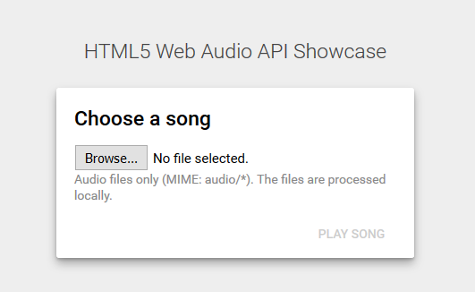
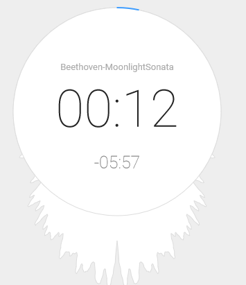

# HTML5 Audio

<!-- vscode-markdown-toc -->
* 1. [Objectives](#Objectives)
* 2. [Documentation](#Documentation)
* 3. [Demos](#Demos)
* 4. [Assignments (Solved)](#AssignmentsSolved)
	* 4.1. [Assignment 1](#Assignment1)
	* 4.2. [Assignment 2](#Assignment2)
	* 4.3. [Assignment 3](#Assignment3)
* 5. [Bibliography](#Bibliography)

<!-- vscode-markdown-toc-config
	numbering=true
	autoSave=true
	/vscode-markdown-toc-config -->
<!-- /vscode-markdown-toc -->

##  1. Objectives
- playing audio files in the browser using the `<audio>` element;
- controlling the audio playback (play/pause/stop/etc.) using the `HTMLAudioElement` interface;
- capturing sound from the microphone using the `Web RTC API`;
- analyzing the sound using the `Web Audio API` and displaying sound visualisations;
- performing speech recognition using the `Speech API`.

##  2. Documentation
-   HTML Audio Element (HTML):
    <https://developer.mozilla.org/en-US/docs/Web/HTML/Element/audio>
-   HTMLAudioElement interface (JavaScript - HTML Media API):
    <https://developer.mozilla.org/en-US/docs/Web/API/HTMLAudioElement>
-   Web Audio API:
    <https://developer.mozilla.org/en-US/docs/Web/API/Web_Audio_API>
-   Web RTC API:
    <https://developer.mozilla.org/en-US/docs/Web/API/MediaDevices/getUserMedia>
- Speech API: <https://w3c.github.io/speech-api/webspeechapi.html>, <https://developer.mozilla.org/en-US/docs/Web/API/SpeechRecognition>

##  3. Demos

-   Sound visualization using HTM5 Canvas:
    <http://nipe-systems.de/webapps/html5-web-audio/>

    

    

-   Creating visualizations:
    <https://developer.mozilla.org/en-US/docs/Web/API/Web_Audio_API/Visualizations_with_Web_Audio_API>

-   Record and save as MP3:
    <http://audior.ec/blog/recording-mp3-using-only-html5-and-javascript-recordmp3-js/>
    , <https://www.html5rocks.com/en/tutorials/getusermedia/intro/>

##  4. Assignments (Solved)

> A large collection of stock audio that you can use in your applications is available at: https://www.pond5.com

###  4.1. Assignment 1
1. Try the "audio-playlist" sample by clicking [here](https://ase-multimedia.azurewebsites.net/audio-playlist).
2. Check the source code.

###  4.2. Assignment 2
1. Try the "audio-web-audio-api" sample by clicking [here](https://ase-multimedia.azurewebsites.net/audio-web-audio-api).
2. Check the source code.

###  4.3. Assignment 3
1. Try the "speech-api" sample by clicking [here](https://ase-multimedia.azurewebsites.net/speech-api).
2. Check the source code.

##  5. Bibliography
-   HTML Audio Element (HTML):
    <https://developer.mozilla.org/en-US/docs/Web/HTML/Element/audio>
-   HTMLAudioElement interface (JavaScript - HTML Media API):
    <https://developer.mozilla.org/en-US/docs/Web/API/HTMLAudioElement>
-   Web Audio API:
    <https://developer.mozilla.org/en-US/docs/Web/API/Web_Audio_API>
-   Web RTC API:
    <https://developer.mozilla.org/en-US/docs/Web/API/MediaDevices/getUserMedia>
- Speech API: <https://w3c.github.io/speech-api/webspeechapi.html>, <https://developer.mozilla.org/en-US/docs/Web/API/SpeechRecognition>